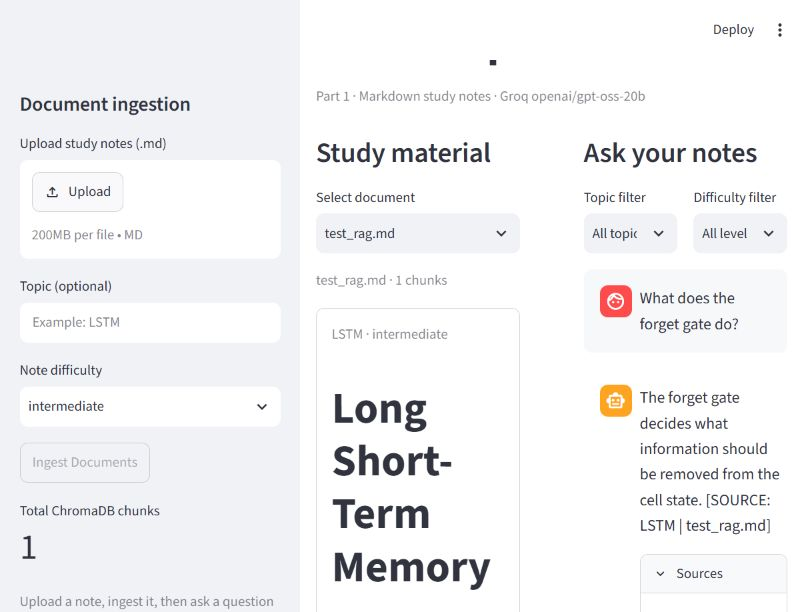

# Agentic RAG Workshop — Part 1

A working Markdown question-and-answer demo using **Streamlit**, **ChromaDB**,
local **all-MiniLM-L6-v2** embeddings, and Groq **openai/gpt-oss-20b**.
Based on the [instructor starter repository](https://github.com/gitmystuff/deep-learning-rag-agent).

## Setup

Requires Git, uv, and Python 3.11 or 3.12. Run these commands from this repository:

```powershell
uv sync
Copy-Item .env.example .env
```

On macOS/Linux use `cp .env.example .env` instead.
Edit your local `.env`:

```dotenv
LLM_PROVIDER=groq
GROQ_MODEL=openai/gpt-oss-20b
GROQ_API_KEY=your_own_groq_api_key
EMBEDDING_PROVIDER=local
EMBEDDING_MODEL=all-MiniLM-L6-v2
```

Get your own key from [Groq](https://console.groq.com/keys).
Never commit `.env` or share the key. The first run downloads the local embedding model.
`torchvision` and the Markdown splitter are recorded in `pyproject.toml` and `uv.lock`.

## Run the demo

```powershell
uv run streamlit run src/rag_agent/ui/app.py
```

1. Select the included `test_rag.md` in the sidebar.
2. Set the optional topic to **LSTM**, then click **Ingest Documents**.
3. Confirm the added-chunk message and a ChromaDB chunk count greater than zero.
4. Upload/ingest the same note again: all existing chunks are skipped.
5. Ask **What does the forget gate do?**
6. Check the answer and the expanded **Sources** area.
7. Ask **What is the history of the Roman empire?** to exercise the no-context guard.

## Implementation

- `config.py`: cached CPU embedding factory and validated Groq LLM factory.
- `corpus/chunker.py`: header-aware Markdown splitting, 512-character chunks with
  50-character overlap, metadata inference/overrides, deterministic source-plus-text IDs.
- `vectorstore/store.py`: persistent cosine Chroma collection, 100-chunk embedding
  batches, deduplication, retrieval thresholds, combined topic/difficulty filters,
  document inspection, and deletion.
- `agent/rag.py`: retrieve evidence before calling the LLM, include source labels,
  require answers grounded in the supplied context, and trim conversation history.
  When no chunk meets the configured threshold, return a no-context message without
  calling the LLM.
- `ui/app.py`: cached resources, multi-file Markdown upload, document viewer, chat
  history, and source citations.

The Part 1 UI uses a direct RAG path. The starter LangGraph interview workflow and
alternative LLM providers remain outside this submission's required implementation.
PDF ingestion is not required by the supplied workshop instructions.

## Checks

```powershell
uv run pytest tests/ -q
git check-ignore .env
```

The 19 tests cover real local embeddings and ChromaDB retrieval, persistence,
duplicate uploads, filters, relevance thresholds, Markdown boundaries, metadata,
empty input, and the no-context generation guard. Generation unit tests use an
explicit test double; the submission screenshot must show a separate real Groq run.

Local Chroma data and credentials are ignored. Rebuild the database by ingesting
the included note after cloning.

## Submission evidence

The real working-demo screenshot is saved as `screenshots/rag_demo.png`.
It must show the question, real model answer, and source attribution.
Submit this repository's URL in Canvas.



See [validation results](docs/part1_validation.md) for the completed checks.
